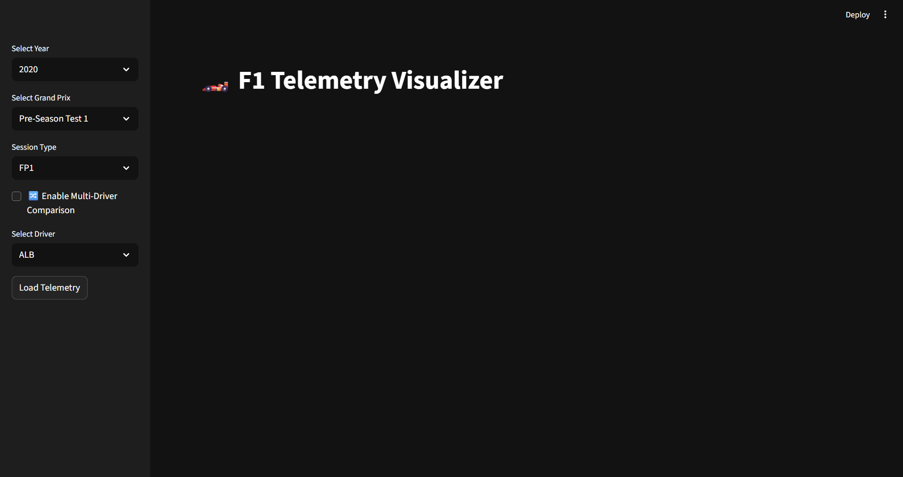
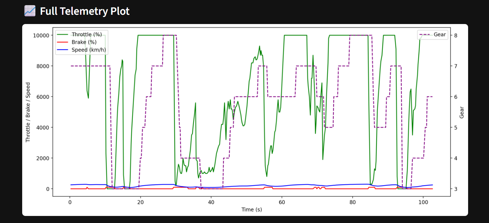
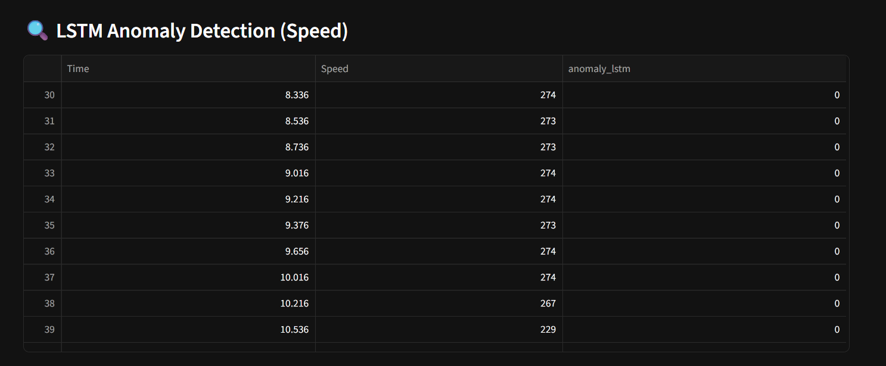
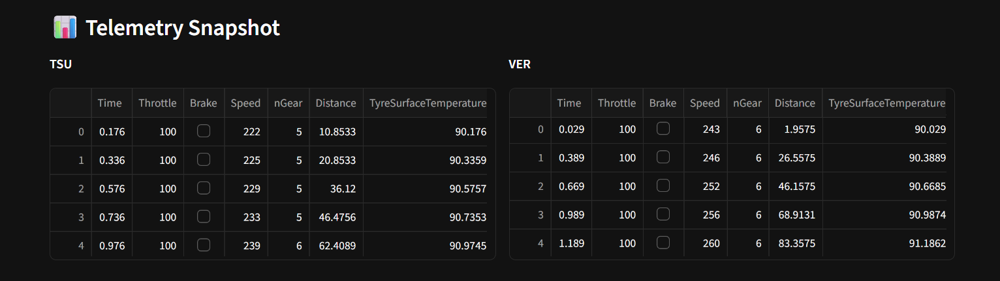
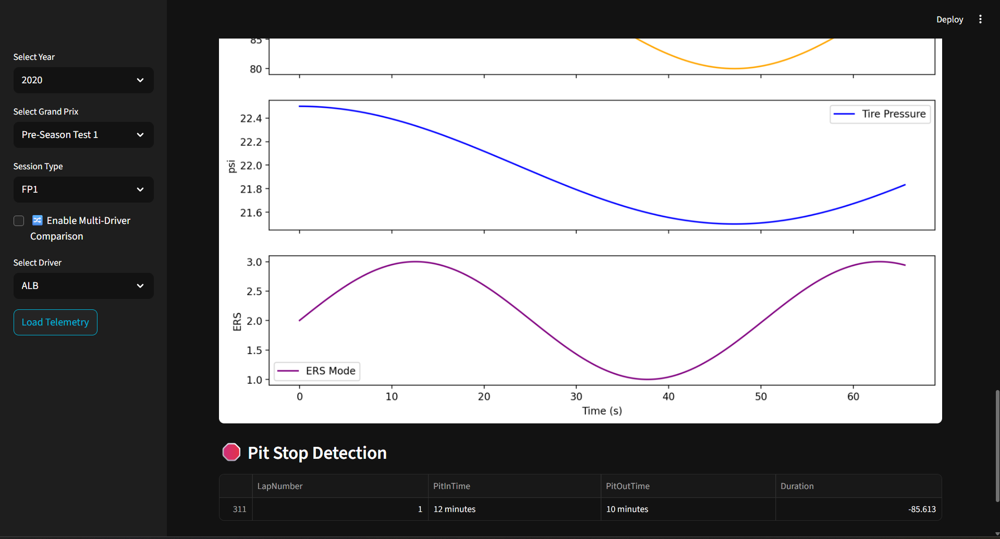

🏎️ Sensor Fault Detection with F1 Telemetry Dashboard

This project combines machine learning (LSTM Autoencoder) with real Formula 1 telemetry data to perform anomaly detection on sensors. It provides an interactive dashboard built with Streamlit that allows engineers to analyze telemetry, detect faults, and visualize anomalies in real time. The dashboard enables visualization of speed, throttle, brake, gear, tire pressure, and ERS usage, along with multi-driver comparisons, lap-by-lap replay, and track map visualization. The LSTM Autoencoder highlights anomalies in sensor readings (such as sudden drops or spikes), offering meaningful engineering insights.

🚀 Getting Started

Clone the repository:

git clone https://github.com/iamarshiya/sensor-fault-detection.git
cd sensor-fault-detection

Create a virtual environment and activate it:

python -m venv venv  
.\venv\Scripts\activate   # On Windows  
source venv/bin/activate  # On Mac/Linux  

Install dependencies:

pip install -r requirements.txt

Run the dashboard:

streamlit run dashboard.py

📷 Screenshots

  
  
  
  
  
 

📂 Project Structure
sensor-fault-detection/
│-- dashboard.py
│-- f1_data_extractor.py
│-- lstm_autoencoder.py
│-- requirements.txt
│-- data/
│-- screenshots/
    │-- dashboard_home.png
    │-- telemetry_plot.png
    │-- track_map.png
    │-- anomaly_detection.png
    │-- multi_driver_comparison.png
    │-- pit_stop_detection.png
 

🎯 Future Improvements

Add support for ERS deployment and DRS zones.

Deploy dashboard on Streamlit Cloud or HuggingFace Spaces.

Integrate with real-time telemetry streaming.

👩‍💻 Author

Your Name – Aspiring Electronics & Telecommunication Engineer | AI + Motorsport Enthusiast
